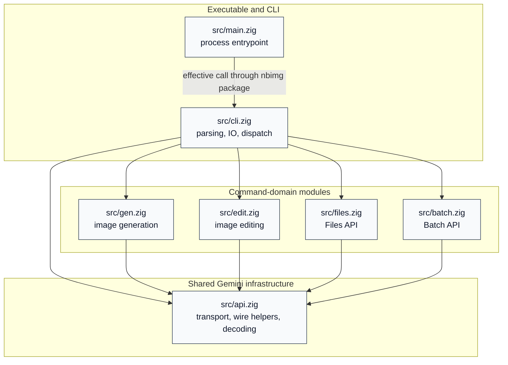

# Module Dependencies

This graph covers the project Zig modules in `src/`, excluding `src/root.zig`
and `src/public_api_test.zig` as package wiring and API allowlist tests.

`src/main.zig` imports the `nbimg` package module through the excluded
`src/root.zig`; the diagram flattens that package edge to the effective runtime
call into `src/cli.zig`.

## Module Descriptions

| Module | Description | Project dependencies |
| --- | --- | --- |
| `src/main.zig` | Executable entrypoint; exits with the process status returned by `cli.run`. | `src/cli.zig` effectively, through excluded package root wiring |
| `src/cli.zig` | Owns user-facing parsing, help, diagnostics, environment lookup, request dispatch, response handling, output writes, and locked Batch JSONL appends. | `src/api.zig`, `src/gen.zig`, `src/edit.zig`, `src/files.zig`, `src/batch.zig` |
| `src/api.zig` | Owns shared Gemini infrastructure: model constants, transport helpers, response ownership, resource-name validation, MIME handling, request assembly, response decoding, output naming, and traffic logging. | None |
| `src/gen.zig` | Owns `gen` API behavior: prompt content construction, generateContent request JSON, countTokens wrapping, and generation transport. | `src/api.zig` |
| `src/edit.zig` | Owns `edit` API behavior: uploaded image reference content, edit manifest text, File API URI derivation, request JSON, and countTokens wrapping. | `src/api.zig` |
| `src/files.zig` | Owns Gemini Files API behavior: upload/list/get/delete request construction, endpoint handling, response decoding, and upload policy. | `src/api.zig` |
| `src/batch.zig` | Owns Gemini Batch API behavior: JSONL entry serialization and validation, input upload, submit/status/cancel/list/download requests, output decoding, and safe output keys. | `src/api.zig` |
