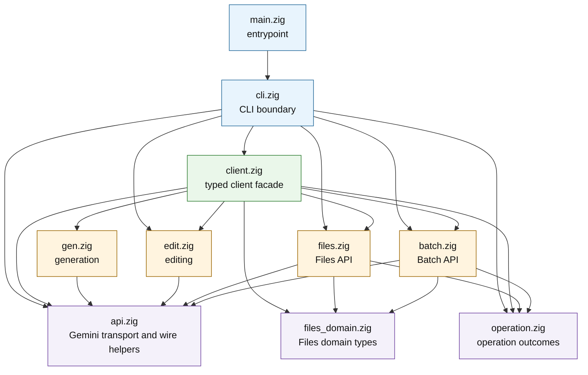

# Module Graph

This document summarizes the essential implementation modules and their direct
project dependencies. Arrows point from a module to another project module it
imports. The graph omits `std` and generated `build_options` imports.

## Module Types

| Type | Modules | Role |
| --- | --- | --- |
| Entrypoint and CLI | `main.zig`, `cli.zig` | `main.zig` delegates process execution to the CLI. `cli.zig` owns user-facing parsing, diagnostics, environment lookup, filesystem effects, request dispatch, Batch JSONL appends, output writing, and exit-code handling. |
| Typed client facade | `client.zig` | Exposes the supported typed client surface and bridges borrowed public request values into internal command, domain, and transport paths. |
| Command/API domains | `gen.zig`, `edit.zig`, `files.zig`, `batch.zig` | Own command-specific request construction, validation, endpoint behavior, response decoding, and domain limits. |
| Shared internals | `api.zig`, `files_domain.zig`, `operation.zig` | Hold cross-command Gemini transport and wire helpers, canonical resource-name and MIME handling, shared Files domain values, remote-error decoding, and typed operation outcomes. |

## Module Notes

| Module | Direct project dependencies | Brief description |
| --- | --- | --- |
| `main.zig` | `cli.zig` | Minimal executable entrypoint that calls `cli.run(init)` and exits with the returned status. |
| `cli.zig` | `api.zig`, `batch.zig`, `client.zig`, `edit.zig`, `files.zig`, `operation.zig` | Command parser and effect boundary for API keys, stdin, files, logs, generated outputs, and process status. |
| `client.zig` | `api.zig`, `batch.zig`, `edit.zig`, `files_domain.zig`, `files.zig`, `gen.zig`, `operation.zig` | Public typed client facade, request validation bridge, result ownership surface, and quiet context-taking operations. |
| `api.zig` | None | Shared Gemini request contexts, transport, JSON posting, resumable uploads, canonical names, MIME handling, generation request envelopes, response decoding, and traffic logging support. |
| `gen.zig` | `api.zig` | Generation-specific prompt content and request construction for immediate calls, countTokens validation, and Batch preparation. |
| `edit.zig` | `api.zig` | Edit-specific uploaded image reference validation, role labels, manifest text, File API URI derivation, and request construction. |
| `files.zig` | `api.zig`, `files_domain.zig`, `operation.zig` | Files API upload, list, get, delete behavior plus typed response classification. |
| `batch.zig` | `api.zig`, `files_domain.zig`, `operation.zig` | Batch JSONL validation, prepared entries, upload/create/status/cancel/list behavior, output download, and strict output-record parsing. |
| `files_domain.zig` | None | Shared public Files request/result/state/source declarations, upload limits, file metadata decoding, and remote-error decoding. |
| `operation.zig` | None | Shared `ApiFailure`, `Outcome(T)`, and stage-aware `OperationOutcome(T)` result wrappers. |
